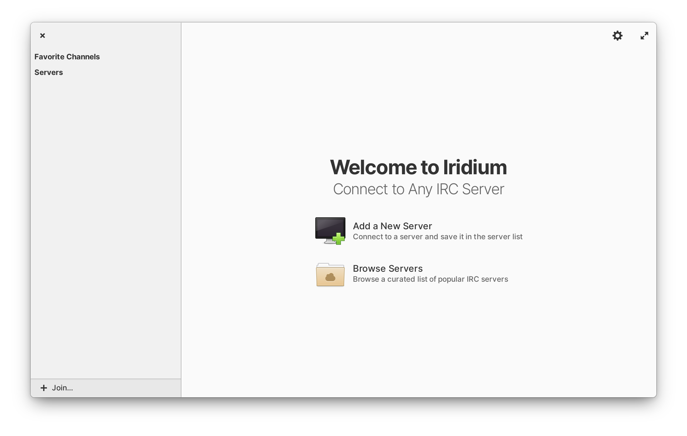

<p align="center">
  
</p>
<h1 align="center">Iridium</h1>



## The friendly IRC client

Iridium is a native Linux IRC client built in Vala and Gtk for elementary OS.

## Install from Source

You can install Iridium by compiling from source. Here's the list of
dependencies required:

- `granite (>= 0.5.1)`
- `debhelper (>= 10.5.1)`
- `gettext`
- `libgtk-3-dev (>= 3.10)`
- `libgee-0.8-dev`
- `meson`
- `valac (>= 0.28.0)`

## Building and Running

To build:

```
$ meson build --prefix=/usr
$ cd build
$ ninja
```

To run:

```
$ sudo ninja install
$ com.github.avojak.iridium
```

### Development Build

You can also install a development build alongside a stable version by specifying the dev profile:

```
$ meson build --prefix=/usr -Dprofile=dev
$ cd build
$ ninja
$ sudo ninja install
$ com.github.avojak.iridium-dev
```

### Updating Translations

When new translatable strings are added, ensure that `po/POTFILES` contains a
reference to the file with the translatable string.

Update the `.pot` file which contains the translatable strings:

```
$ ninja com.github.avojak.iridium-pot
```

Generate translations for the languages listed in the `po/LINGUAS` files:

```
$ ninja com.github.avojak.iridium-update-po
```

## Feature TODO List

This project is very much in-progress and has a lot of remaining work. Here is a list of features I plan on implementing that I will update upon completion:

- [x] Automatically open chat views for joined channels and incoming direct messages
- [x] Support leaving channels and disconnecting from servers
- [x] Auto-scrolling for new messages
- [x] Unread message badges for channels
- [ ] Support authentication for servers
- [x] Special formatting for usernames and URLs in messages
- [x] Favorite channels
- [x] Save and restore state when closing and re-opening
- [x] Display channel users list
- [x] Easy way to initiate a private message chat view
- [ ] Display available channel list
- [x] Respond to network loss and re-connection
- [ ] Lock scrolling when reading old messages
- [x] Display channel topic
- [ ] Allow suppressing of join/part messages
- [ ] Display date/time information in the chat view after a certain amount of time has passed
- [ ] Display an indicator for where the last read message is in the chat view
- [ ] Display badge count of unread messages in the dock
- [ ] Integrate with the OS notifications
- [ ] Audio notification when a message is received
- [ ] Add server/channel history even when a connection is closed so that you can open from history in the welcome view

These are some ideas I think might been cool to implement, but may add too much complexity or clutter to the UI and the project as a whole:

- [ ] Toast notification when mentioned in a channel, regardless of where you are currently in the app
- [ ] Support message formatting (See: [IRC Formatting](https://modern.ircdocs.horse/formatting.html))
