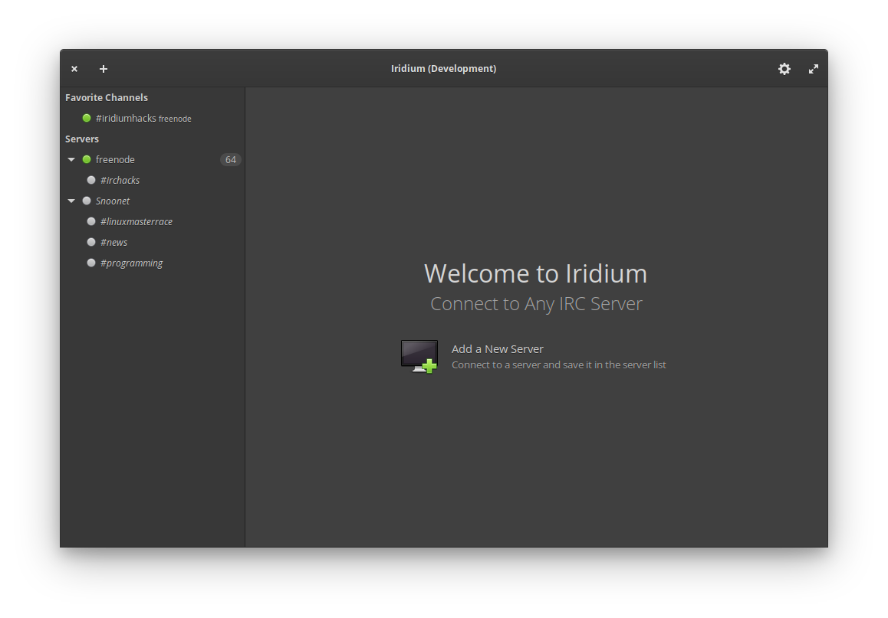

[](https://travis-ci.com/avojak/iridium)


<p align="center">
  
</p>
<h1 align="center">Iridium</h1>



## The friendly IRC client

Iridium is a native Linux IRC client built in Vala and Gtk for [elementary OS](https://elementary.io).

## Install from Source

You can install Iridium by compiling from source. Here's the list of
dependencies required:

- `granite (>= 0.5.1)`
- `debhelper (>= 10.5.1)`
- `gettext`
- `libgtk-3-dev (>= 3.10)`
- `libgee-0.8-dev`
- `libsecret-1-dev`
- `libsqlite3-dev`
- `meson`
- `valac (>= 0.28.0)`
- `libsqlite3-dev`
- `libgtksourceview-3.0-dev`

An `install-dev-dependencies.sh` script is available to help developers get up and running.

## Building and Running

```
$ meson build --prefix=/usr
$ sudo ninja -C build install
$ com.github.avojak.iridium
```

### Development Build

You can also install a development build alongside a stable version by specifying the dev profile:

```
$ meson build --prefix=/usr -Dprofile=dev
$ sudo ninja -C build install
$ com.github.avojak.iridium-dev
```

### Updating Translations

When new translatable strings are added, ensure that `po/POTFILES` contains a
reference to the file with the translatable string.

Update the `.pot` file which contains the translatable strings:

```
$ ninja com.github.avojak.iridium-pot
```

Generate translations for the languages listed in the `po/LINGUAS` files:

```
$ ninja com.github.avojak.iridium-update-po
```

### Testing

To facilitate testing, a `test-server.py` script is available which starts a local IRC server using Docker.

```bash
$ ./test-server.py [-h] {create|start|watch|stop|reset}
```

## Project Status

This project is very much in-progress and has a lot of remaining work. Check out the [Projects](https://github.com/avojak/iridium/projects) page to track progress towards the next milestone.

Please keep in mind that at this time I am developing Iridium as a personal project in my limited free time to learn Vala and contribute back to the [elementary OS](https://elementary.io) community, so do not be offended if I reject a pull request or other contribution.
